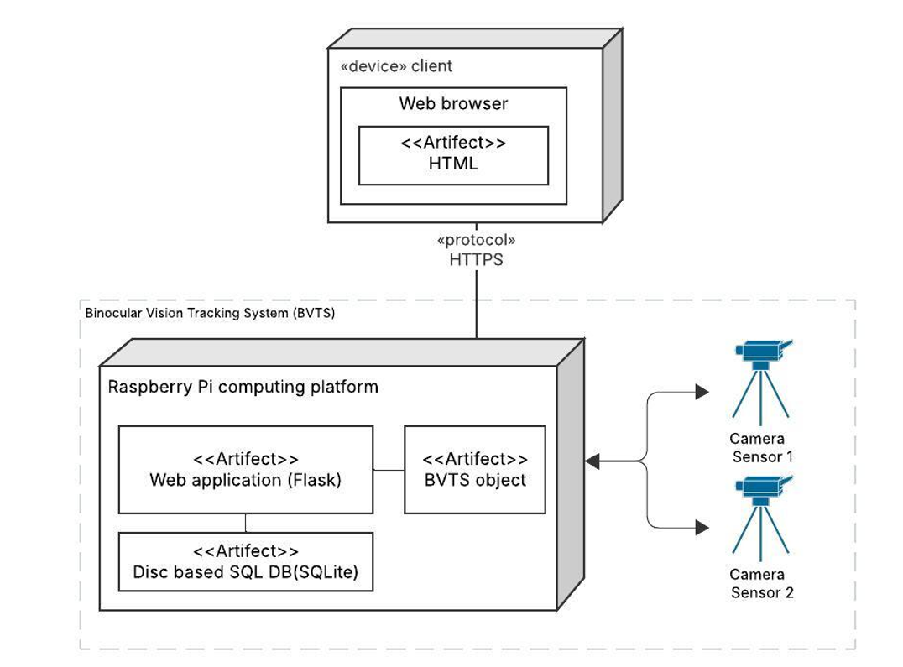
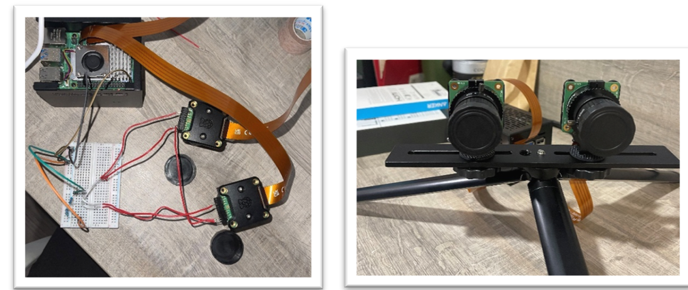
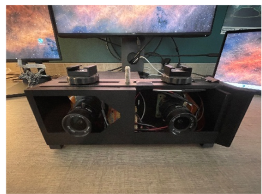
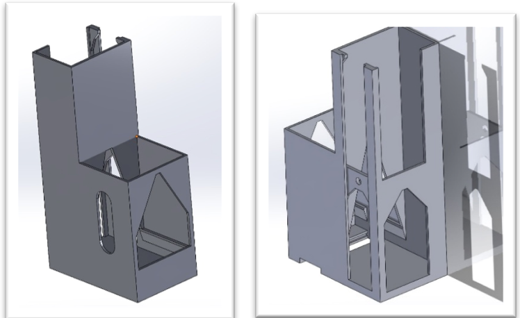
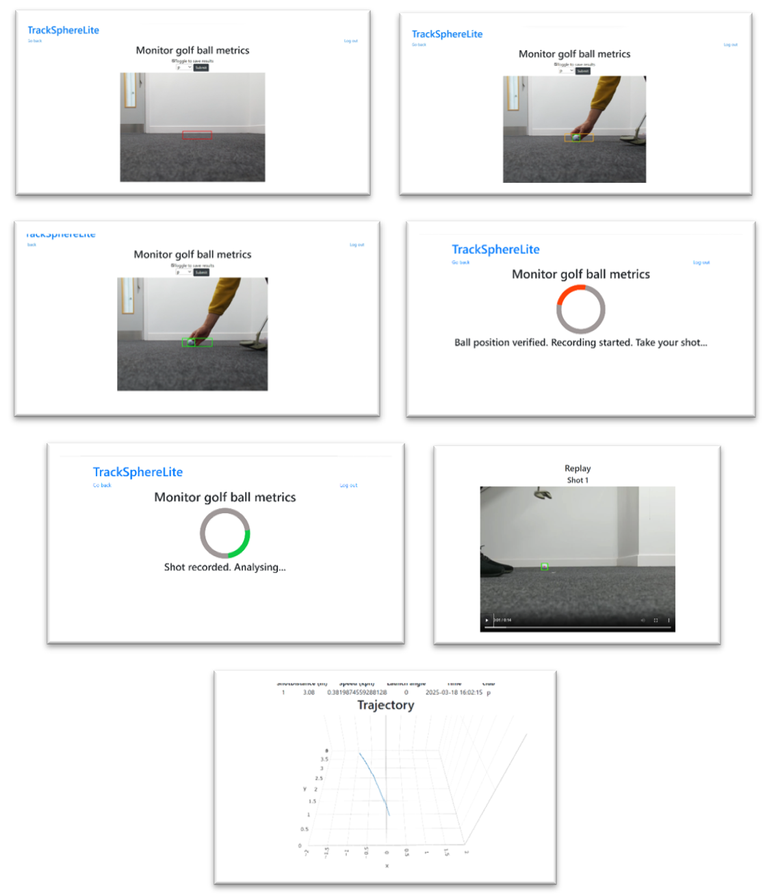
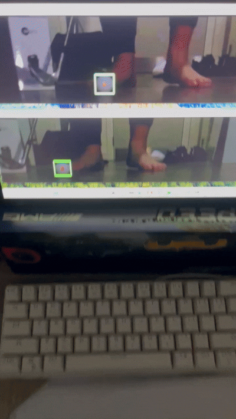
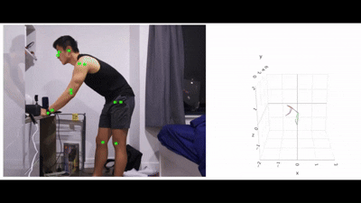

# TrackSphereLite

Stereo vision based 3D reconstruction system built using Raspberry Pi components. This system primary tracks golf ball and models its motion in 3D, however it is also capable of tracking any object in 3D given that there is an object detection model for the application.

Object Detection model accuracy metrics:
- [Golf ball object detection model evaluation](./demo/detection_model_training_result.png)
- [Golf ball object detection model training logs](./demo/object_detection_model_training_log.png)

3D reconstruction model accuracy metrics:
- [3D reconstruction model (depth) evaluation](./demo/depth_reconstruction_model_rmse.png)
- [3D reconstruction model (x/y position) evaluation](./demo/xy_reconstruction_model_rmse.png)
 

For object detection model development view view [Object Detection Model Development](./peripheral_code/ObjectDetectionModelDevelopment)

For the 3D reconstruction algorithm development view [Reconstruct 3D Model Development](./peripheral_code/Reconstruct3DModelDevelopment)

## Architecture (Binocular Vision based Tracking System - BVTS)

## Hardware
### V1 

## V2

| Hardware            | Enclosure                      |
| ------------------- | ------------------------------ |
|  |  |
## Software

## Demo
### Stereo vision camera synchronisation and golf ball detection


### 3D reconstruction of golf ball motion

| figure of 8 motion          | rolling ball            |
| --------------------------- | ----------------------- |
|  |  |
### 3D reconstruction accuracy

### Other application of 3D reconstruction via stereo vision

## License

[MIT](https://choosealicense.com/licenses/mit/)


## Installation

follow this first
https://forums.raspberrypi.com/viewtopic.php?t=361758

First clone the project at the directory of choice and cd into it.

```bash
git clone https://github.com/itsjihunpark/TrackSphereLite.git
```

```bash
cd TrackSphereLite
```

To run this server, you must first install a few libraries.

Before installing any libraries, you must first create a python virtual environment. To find out more about virtual environments ([Python doc](https://docs.python.org/3/library/venv.html))

To create a virtual environment. The below creates a virtual environment named .venv

```bash
python -m venv .venv
```

Once the above runs, you must activate the virtual environment. Keep in mind that it is a backslash.

```bash
.venv\Scripts\activate
```

Once activated, to install required libraries, run

```bash
pip install -r requirements.txt
```

Now you are ready to run the application.

## Usage

Before running the application, you must always activate the virtual environment.

```bash
cd TrackSphereLite
```

```bash
.venv\Scripts\activate
```

Once activated run

```bash
.venv\Scripts\activate
```

```bash
flask --app TrackSphereLite run --debug
```

The app should be running by now. If its not working contact ([some way to get in contact with jihun :)](mailto:jihunpark0989@gmail.com))
